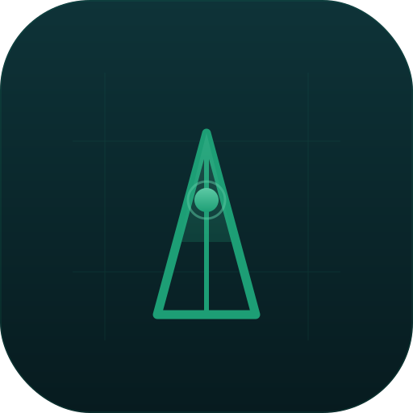

# FileAtlas

   

<p align="center">
  
</p>

FileAtlas ist eine native macOS-App zum Indizieren und Vergleichen von Dateien, entwickelt ausschliesslich mit Apple-Frameworks. Die App hilft beim Scannen von Ordnern, Pruefen von Metadaten, Finden von Duplikaten, Vergleichen von Snapshots, Exportieren von Berichten und Verwalten von Backups ohne externe Abhaengigkeiten.

> **Sicherheit:** Es wurden keine privaten Daten, API-Keys oder Zertifikate veroeffentlicht. Die App sendet keine Netzwerkanfragen und speichert alle Daten lokal. Siehe [SECURITY.md](SECURITY.md) fuer den vollstaendigen Audit.


[🇬🇧 English Description](README.md)

## Funktionen

- Lokale Dateiindizierung mit rekursivem Ordnerscan und Live-Fortschritt (AsyncStream)
- Mehrere Ordner gleichzeitig scannen
- Security-Scoped Bookmarks (Zugriff bleibt nach App-Neustart erhalten)
- Liquid-Glass-Seitenleiste (Desktop scheint durch)
- Umschalter fuer Hell / Dunkel / System (unabhaengig von der macOS-Einstellung)
- DE/EN-Lokalisierung mit DACH-Regel (de_AT, de_DE, de_CH immer Deutsch)
- Sortierbare, neu anordenbare Spalten (Name, Typ, Status, Tags, Groesse, Geaendert)
- Einstellbare Zeilenhoehe (Kompakt / Normal / Gross)
- QuickLook-Vorschau (Leertaste)
- Schnellsuche nach Name, Endung und Groesse (`> 10 MB`, `< 500 KB`)
- Speicherbare Filtersaetze mit Einschluss- und Ausschlusslisten
- Ignorierte Ordner (beim Scan uebersprungen, als einzelner Eintrag mit Gesamtgroesse angezeigt)
- Bundle-Erkennung (`.app`, `.framework`, `.xcodeproj` als einzelne Eintraege, Unterelemente werden uebersprungen)
- Extension-Whitelist-Filter (nur bestimmte Dateitypen indexieren)
- Kein Auto-Rescan wenn Ordner bereits indexiert ist
- Duplikaterkennung (Groessengruppierung -> SHA-256-Hash, goldenes Abzeichen)
- Snapshots nach jedem Scan (max. 10, JSON) mit Diff-Vergleich und Loeschen
- Ordnervergleich (zwei Ordner direkt)
- Tags (vordefiniert + benutzerdefiniert, farbcodierte Pills)
- Unterordner-Anzeige in der Seitenleiste (mehrstufig, ohne UI-Freeze)
- Schnellzugriff (letzte 5 gescannte Ordner in der Seitenleiste, manuell verwaltet)
- Export: Excel (`.xlsx`), PDF, CSV
- Backup: Index-Backup (JSON) und Vollbackup (ZIP, optional AES-256, Passwort im Schluesselbund)
- Backup-Zeitplan: Aus / Taeglich / Woechentlich pro Speicherort
- Einstellungsfenster mit Seitenleistennavigation (im Stil der macOS-Systemeinstellungen)
- Info & Kontakt-Bereich in den Einstellungen
- Cache leeren in den Einstellungen
- Keine externen Abhaengigkeiten - nur reine Apple-Frameworks

## Voraussetzungen

- macOS 26.5+
- Xcode mit Swift-6-Unterstuetzung
- Keine externen Abhaengigkeiten

## Installation

1. Repository klonen.
2. `FileAtlas.xcodeproj` in Xcode oeffnen.
3. App bauen und starten.

Alternativ das aktuelle DMG oder ZIP von der [Releases](../../releases)-Seite herunterladen.

## macOS Gatekeeper Hinweis

FileAtlas ist nicht mit einem Apple-Entwicklerzertifikat signiert. Beim ersten Start kann macOS die App mit der Meldung *„FileAtlas kann nicht geoeffnet werden, weil es von einem nicht verifizierten Entwickler stammt."* blockieren.

**So oeffnest du die App dennoch:**

1. `FileAtlas.app` doppelklicken — macOS blockiert sie und zeigt eine Warnung
2. **Fertig** klicken
3. **Systemeinstellungen → Datenschutz & Sicherheit** oeffnen
4. Nach unten scrollen und neben FileAtlas auf **Trotzdem oeffnen** klicken
5. Im letzten Dialog mit **Oeffnen** bestaetigen

macOS merkt sich die Entscheidung — dieser Schritt ist nur einmalig notwendig.

> Falls macOS **„FileAtlas.app ist beschaedigt"** anzeigt statt der Sicherheitswarnung, Terminal oeffnen und eingeben:
> ```bash
> xattr -cr FileAtlas.app
> ```
> Danach die App normal oeffnen.

## Lizenz

FileAtlas ist unter der GNU General Public License v3.0 lizenziert. Der vollstaendige Lizenztext steht in [LICENSE](LICENSE).
