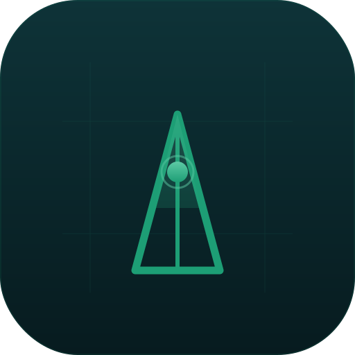

# FileAtlas for macOS – File Indexer, Duplicate Finder & Folder Comparison

[](https://github.com/Schrotty74/FileAtlas/actions/workflows/ci.yml)
[](https://github.com/Schrotty74/FileAtlas/releases)
[](https://github.com/Schrotty74/FileAtlas/releases)

    [](https://discord.gg/Zy93AaYFaj)

<p align="center">
  
</p>

**English** · [Deutsch](README.de.md)

📘 **[User Manual (PDF)](output/pdf/FileAtlas-Manual-EN.pdf)** – scanning, organization, backups, exports, and privacy explained in detail.

## Overview

FileAtlas is a native, privacy-focused macOS file indexer, duplicate finder and folder comparison app built with pure Apple frameworks. It helps scan folders, inspect metadata, detect duplicates, compare snapshots, analyze storage, export reports, and manage backups without external dependencies.

> **Security:** No private data, API keys, or certificates have been published in this repository. FileAtlas stores scan data locally. If update checks are enabled, the app only contacts GitHub Releases to look for a newer version. See [SECURITY.md](SECURITY.md) for the full audit.

## First-Launch Help

When FileAtlas has no saved locations or indexed entries yet, a start screen offers a local folder picker, the manual, and optional help from ChatGPT, Google Gemini, or Claude. Selecting a service copies a general, privacy-safe question with the public manual link to the clipboard and then opens that service; FileAtlas never sends local file data or other user data automatically. See [AI help and privacy notes](AI_HELP.md).

## What's New

- APP bundles and DMG, PKG, ZIP, and ISO files are discovered by their actual final filename extension and indexed as single entries.
- Cached-index restoration can display the last saved index immediately on launch, without an automatic rescan.
- Filter Sets can stay active across locations within their configured scope and can optionally be restored after restarting the app.
- Optional startup update checks can be enabled and show available releases only after a user action.
- Snapshot comparisons no longer report unchanged files as changed because of subsecond timestamp differences.

## Features

- Private local indexing of multiple folders, with persistent access, live progress, search, filters, tags, and QuickLook preview.
- Duplicate detection, snapshots, folder comparison, storage analysis, and local similar-image analysis.
- Safe organization tools: batch rename, reviewable cleanup queue, rules, smart collections, and quick access to recent locations.
- Flexible backups: index, full, incremental, or selected-item ZIP backups with optional AES-256 encryption, SHA-256 verification, archive inspection, selective restore, schedules, and retention.
- Exports to Excel, PDF, and CSV.
- English and German interface, light/dark/system appearance, six themes, Reduce Motion, and configurable tooltips.
- First-launch help and optional update checks are privacy-conscious; an available release opens only after a click. FileAtlas uses no external dependencies.
- The last cached index can be restored immediately on launch, and the active Filter Set can optionally be restored after relaunch.

See the complete, grouped [feature overview](FEATURES.md).

## Requirements

- macOS 26.5+
- Xcode with Swift 6 support
- No external dependencies

## Installation

1. Clone the repository.
2. Open `FileAtlas.xcodeproj` in Xcode.
3. Build and run the app.

Alternatively, download the latest DMG or ZIP from the [Releases](../../releases) page.

## macOS Gatekeeper Notice

FileAtlas is not signed with an Apple Developer certificate. On first launch macOS may block the app with the message *"FileAtlas cannot be opened because it is from an unidentified developer."*

**To open the app anyway:**

1. Double-click `FileAtlas.app` — macOS will block it and show a warning
2. Click **Done**
3. Open **System Settings → Privacy & Security**
4. Scroll down and click **Open Anyway** next to FileAtlas
5. Confirm by clicking **Open** in the final dialog

macOS remembers your choice — this step is only required once.

> If macOS shows **"FileAtlas.app is damaged"** instead of the security warning, open Terminal and run:
> ```bash
> xattr -cr FileAtlas.app
> ```
> Then try opening the app again.

## Community

Questions, feedback and discussions are welcome on [Discord](https://discord.gg/Zy93AaYFaj).

## Repo activity


## License

FileAtlas is licensed under the GNU General Public License v3.0. See [LICENSE](LICENSE) for the full license text.
